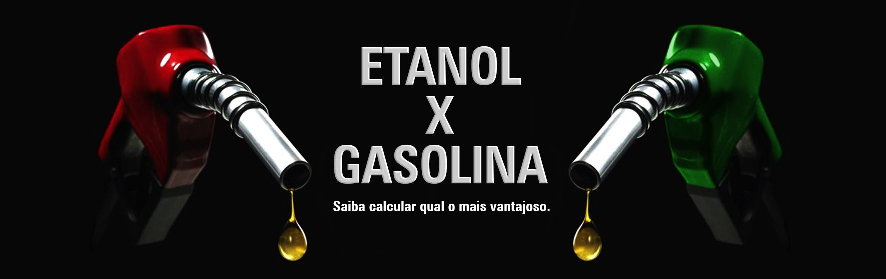

# 🚗 Álcool ou Gasolina? 📊

Este aplicativo foi o quarto aplicativo desenvolvido no Expo Snack como parte da disciplina de Desenvolvimento Mobile da FATEC PG - Tarde. O objetivo deste projeto foi criar um aplicativo simples e funcional com o intuito de ajudar os usuários a decidir se é mais vantajoso abastecer com **álcool** ou **gasolina**, com base nos preços informados.

## 📌 Funcionalidades

* Permite inserir os preços do álcool e da gasolina.  
* Calcula automaticamente qual combustível é mais vantajoso.  
* Exibe o resultado de forma clara e objetiva.  
* Layout simples e responsivo.  

---

## 🛠️ Tecnologias utilizadas

- **React Native**
- **Expo**
- **JavaScript**

---

## 📷 Captura de tela

---

## 🎉 Conclusão
Este projeto foi uma excelente oportunidade para aprender os conceitos básicos do desenvolvimento mobile e aprimorar minhas habilidades em React Native. Estou animado para continuar evoluindo este app e explorar novas funcionalidades!

🚀 Desenvolvido com paixão pelo aprendizado!

